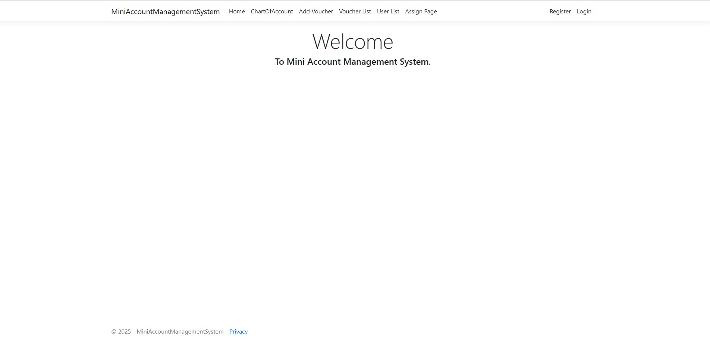
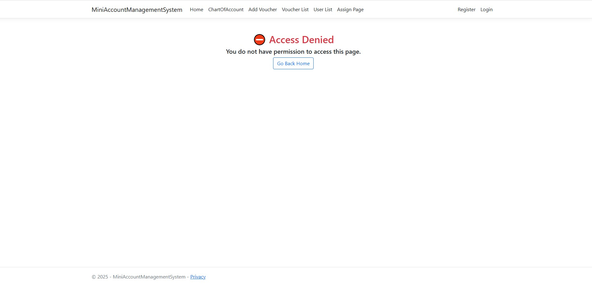
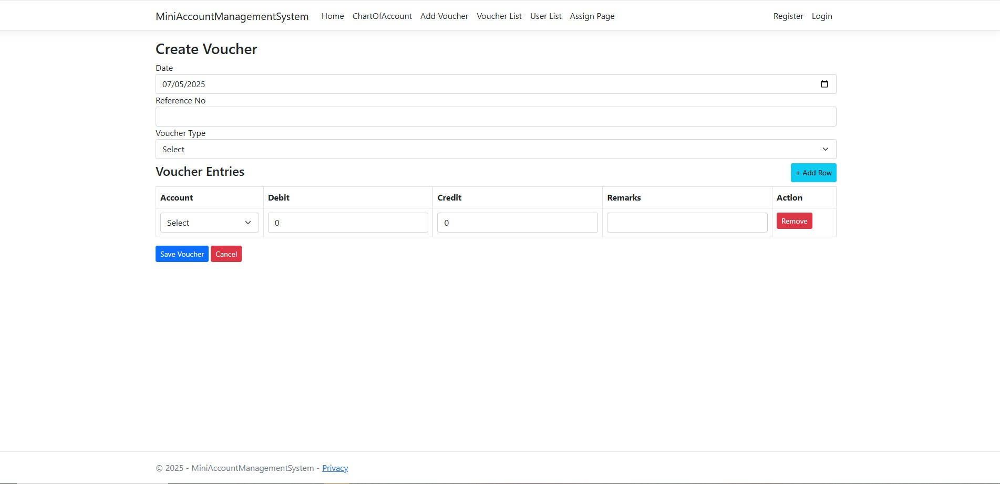
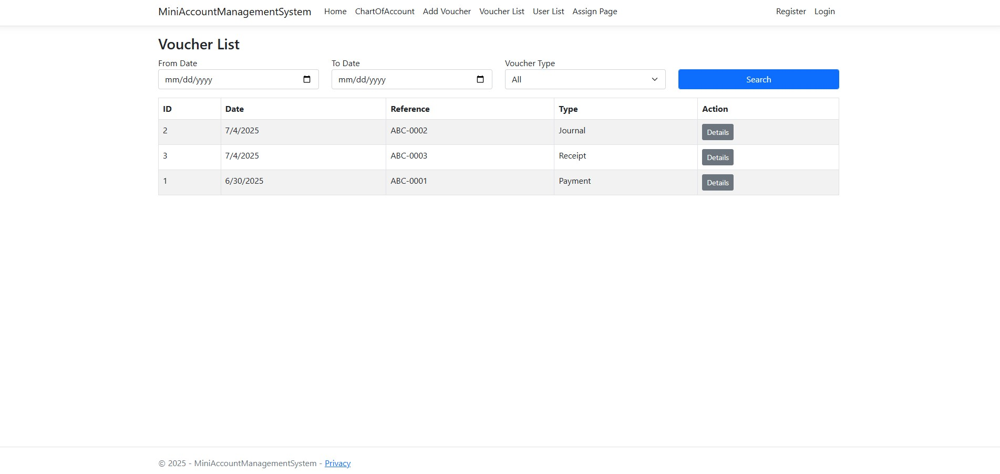
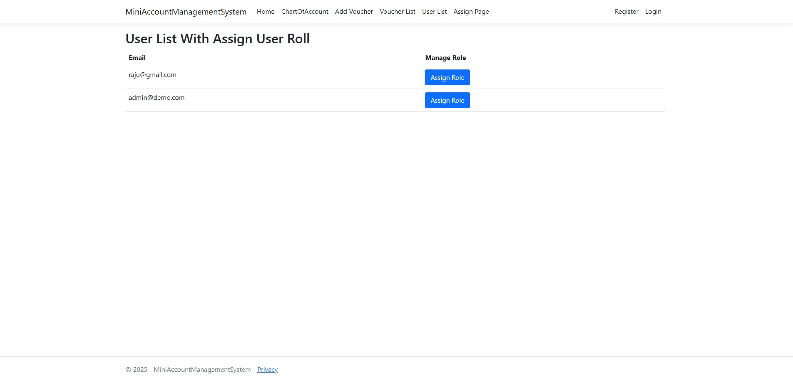
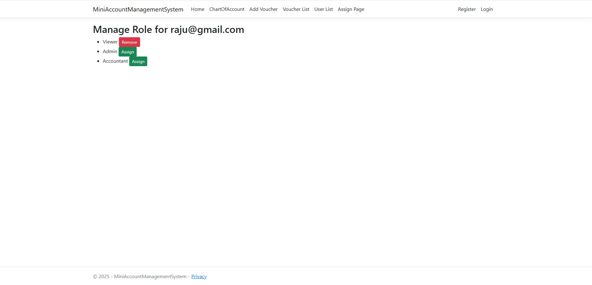
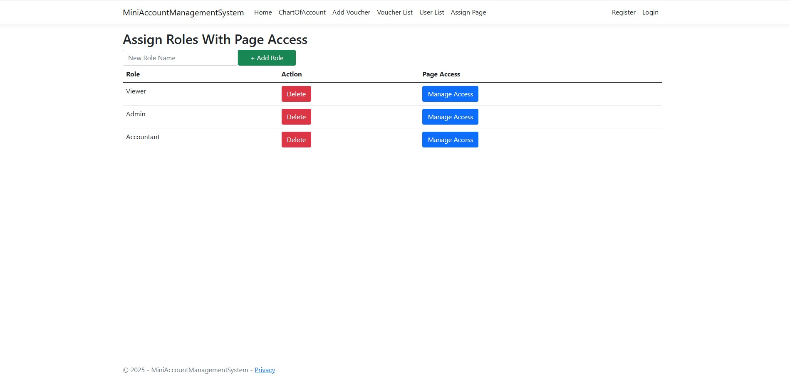
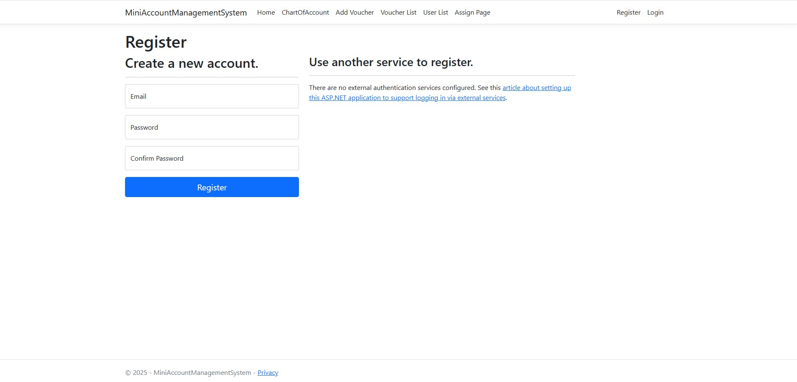
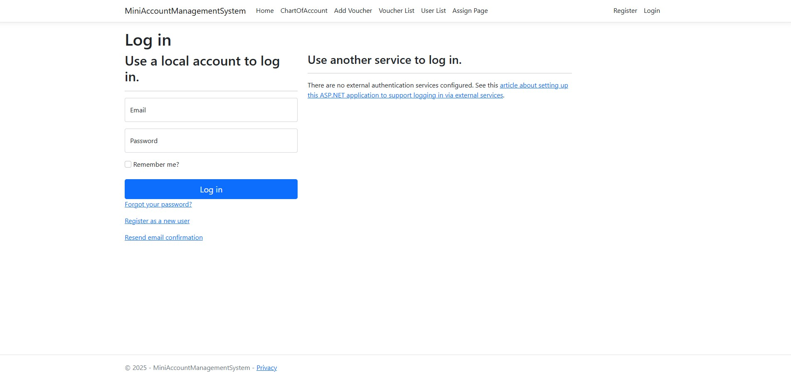

# 💼 Mini-Account-Management-System
A lightweight and professional **Accounting Web Application** built using **ASP.NET Core Razor Pages** and **SQL Server (Stored Procedures only)** Role Based Assign User and Page Access Control by admin. Data Table view with pdf, excel export. 
## 🔧 Technologies Used

- ASP.NET Core Razor Pages (.NET 8)
- MS SQL Server 2019
- ADO.NET (No Entity Framework / No LINQ)
- ASP.NET Identity for Authentication & Custom Roles
- Bootstrap 5

---

## ✅ Core Features Implemented

| Module                        | Description                                                        |
|------------------------------|--------------------------------------------------------------------|
| 🔐 User Management            | Login / Register, Admin assigns roles (Admin, Accountant, Viewer) |
| 🔑 Role Permissions           | Module-level access via Stored Procedure                          |
| 📂 Chart of Accounts (COA)    | Add/Edit/Delete with Tree View display                            |
| 🧾 Voucher Entry              | Journal, Payment, Receipt vouchers with multiple debit/credit     |
| 📄 Voucher List               | Filter by date/type, view details, print                          |
| 🪵 Access Control             | Stored Procedure-based page access (RoleAccess table)             |
| ❌ Access Denied Page         | Friendly error page for unauthorized access                        |

---

## 🧩 Database Design

- `ChartOfAccounts` (self-referencing with `ParentAccountID`)
- `Vouchers` (header)
- `VoucherEntries` (detail lines)
- `RoleAccess` (role-wise module permissions)
- ASP.NET Identity Tables (`AspNetUsers`, `AspNetRoles`, etc.)

---

## 📊 Admin Features

- View all registered users
- Assign/change user roles
- Control module access by role

---

## 📂 Folder Structure
/Pages

/ChartOfAccounts

/Voucher

/AccessDenied

/Models

/Services

/DataAccess

/Areas/Identity/Pages/Account

/Controller/PageAccessController-RoleController-UserRoleController --for Identity 

/Views/PageAcess/Role/UserRole

---
## 🚀 How to Run

1. Clone the repository  
2. Update your `appsettings.json` with your SQL Server connection string  
3. Run `Update-Database` if using migrations  
4. Run the project via Visual Studio / `dotnet run`  

📌 Default Admin User:
Email: admin@demo.com
Password: Admin@123

---

## 📸 Screenshots

 **Home Page**
 
  

**Chart of Accounts Page but this is Authorization Paged for only admin**

  

 **Voucher Entries**
 
  
 
  **Voucher List**
 
  

   **User List with assign role**
 
  
 
  **Manage role with user wise**
 
  

 **Page access with role wise**
 
  

  **Registration Page with Identity Default**
 
  

  **Login Page with Identity Default**
 
  

---

## 📦 Stored Procedures Used

- `sp_ManageChartOfAccounts`
- `sp_SaveVoucher`
- `sp_GetVouchersByFilter`
- `sp_GetVoucherDetails`
- `sp_CheckPageAccess`

---

## 👨‍💻 Developed By

Made with ❤️ by S. M. SHAHAJALAL RAJU Email: smraju115@gmail.com

IsDB-BISEW .NET Trained | Focused on Professional Backend Projects  

